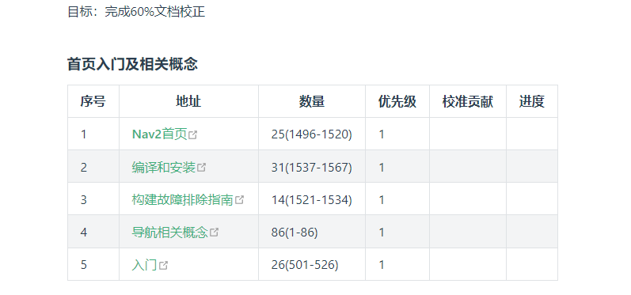
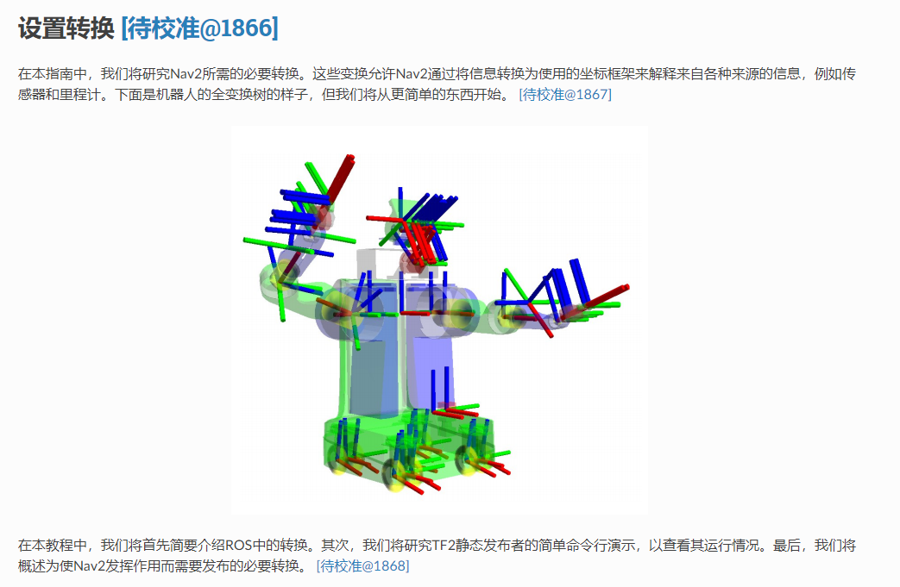
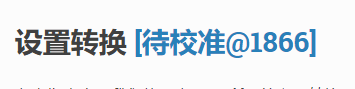

# 初期小伙伴贡献指南

本指南旨在引导初期加入的小伙伴点亮贡献者头像和完成文档校准工作。

## 1.领取任务-点亮头像（本部分忽略-暂定使用腾讯在线文档进行任务选择）

前提条件：

- Github账号和基本操作
- Markdown基础语法

### 1.1 fork仓库

点击本页面右上角[github](https://github.com/fishros/nav2cn)链接，点击fork按钮将仓库fork到自己的github中。

### 1.2 修改内容并提交

1. 克隆自己账号下的nav2cn仓库到本地
2. 切换到dev分支
3. 打开文件 仓库下`docs\pages\contribution\work\planing\README.md`
4. 根据个人情况选择未校准的网页，在贡献一栏填写自己的名字和github主页地址（`[name](https://github.com/xxx)`）
5. 提交代码到dev分支，并推送到github

### 1.3 提交pull request

1. 在自己账户下的nav2cn仓库中切换到dev分支

2. 点击contribute，创建pull request

   

3. 选择目标仓库和分支，点击创建
4. 通知小鱼和并分支

## 2.校准任务

点击表格中的地址跳转到对应的页面

比如：

这里的每一个段落后面后可以看到待校准超链接和该段落对应的id

点击段落后面超链接，即可跳转到校准页面

在校准页面根据原文、上一般翻译内同和对新的翻译内容进行编辑，编辑完成后点击提交按钮即可

注意标记标题并提交按钮用于仅用于段落标题，比如如下的标题

需要注意的是，点击`标记标题并提交`按钮要**确认被该标题的翻译已经准确无误**，被标记标题之后的段落，其后的校准按钮将会被隐藏。

