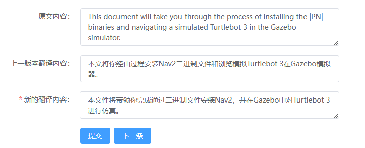
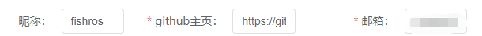

# 校准指南

Nav2中文网文档已通过机器进行初始翻译，需要对其内容进一步校准。

校准通过[开放校准系统]()进行(该系统由[zebra]()提供技术支持)，通过不断更新目前该系统已经非常易用。

您只需要通过以下三步即可贡献您的校准

## 1.找到待校准内容

您可以通过以下两种方式找到待校准的页面：

1. 在[阅读文档](http://dev.nav2.fishros.com/doc)过程中发现不准确的内容，点击段落后面的链接即可

2. 直接进入[Nav2中文网翻译 (fishros.com)](http://dev.nav2.fishros.com/calibpage/#/home?msgid=501)

## 2.进行校准

在页面中根据英文内容和上一版中文内容，更新你的翻译内容

## 3.提交校准内容

校准完成后，在头部输入你的昵称、github主页地址和邮箱地址

> 您的邮箱并不会被公开，为后面发送感谢和邀请使用

填写完成点击提交即可，您的修改会在大约5分钟后同步到 [Nav2文档实时版](http://dev.nav2.fishros.com/doc/)

## 4.持续校准和贡献排行

完成一次校准后，可以电机下一条继续校准，系统将记录您的所有校准记录，并统计您的校准单词个数，后期会推出贡献排行榜，针对于贡献突出的者，将会给予nav2中文网管理权限共同维护，针对突出贡献者还会邀请加入的开源小组。

