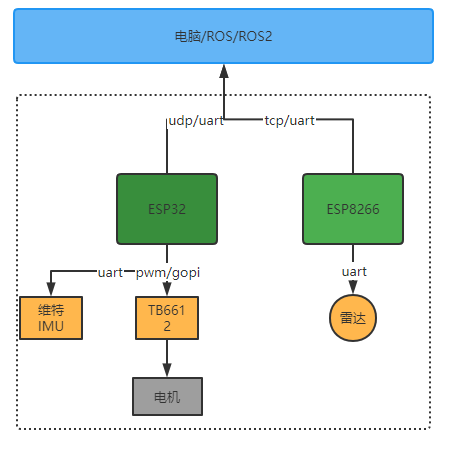

# Fishbot架构介绍

## 硬件结构

- 乐鑫ESP32作为主控
- IMU目前采用维特IMU
- TB6612 用于驱动电机
- 电机采用电磁编码器
- ESP8266主要用于驱动雷拉，代替传统意义树莓派

### 软件结构

软件上一共四层

- 嵌入式采用espidf框架开发
- 激光雷达直接使用ESP8266进行数据转发
- SDK层不包含ROS/ROS2相关的所有控制支持
- Nav2和Cartographer用于导航和建图

## 主要工作

@TODO
